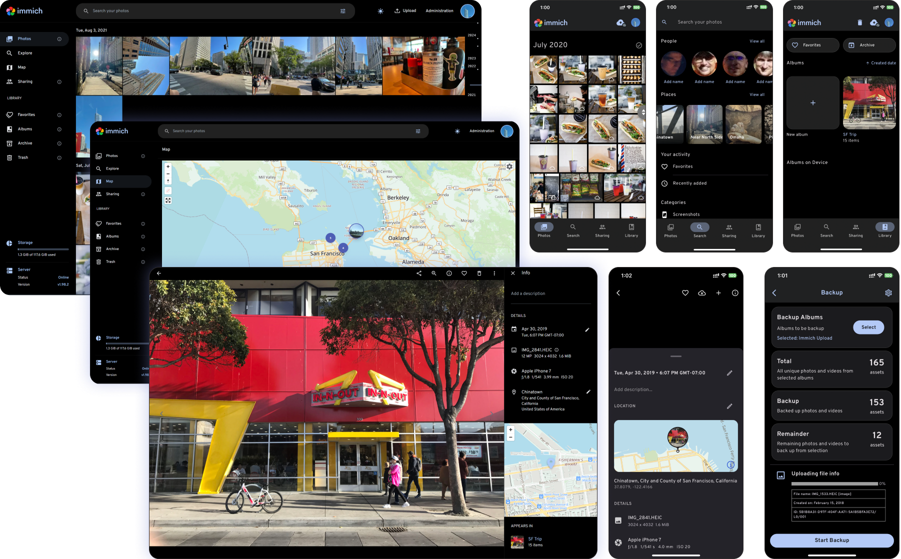

# Inhouse Photos

Inhouse Photos is the Inhouse-branded Android and iOS client for a private Immich server. This fork is pinned to Immich **3.1.0**, uses the original Immich API and data model, and therefore connects to an existing server without migration or downtime.

## Android download

**Recommended for Brave/Android:** [Download Inhouse Photos as a ZIP](https://raw.githubusercontent.com/miguelcoxcaballero/Inhouse-Photos/main/Inhouse-Photos-Android.zip), extract it in the Files app, then tap `Inhouse-Photos.apk` to install it.

[Direct APK download](https://raw.githubusercontent.com/miguelcoxcaballero/Inhouse-Photos/main/Inhouse-Photos.apk) is also available. Both contain the same signed ARM64 build for modern Android phones.

Current Android build: **3.1.35 (5094)**. This build includes reliable three-at-a-time uploads, lightweight progress reporting, stable upload-detail card spacing, on-device Storage saver backup quality, clear original/compressed sizes and savings, fast deduplicated timelines, and the mandatory Inhouse update gate.

Storage saver prepares disposable copies before upload: photos are limited to 16 MP and videos to 1080p while the device originals remain unchanged. It applies only to new uploads, keeps the existing three-item upload concurrency, and never recompresses assets already present on the server.

The Android app checks `android-update.json` on launch, whenever it returns to the foreground, and every 15 minutes. A required newer semantic version blocks the app until its signed APK has been downloaded, package-checked, signature-verified, and handed to Android's installer.

## iOS download without a paid Apple membership

[Download the unsigned Inhouse Photos IPA](https://github.com/miguelcoxcaballero/Inhouse-Photos/releases/download/v3.1.35-inhouse-ios.1/Inhouse-Photos.ipa). It is installed and signed on the phone with a free Apple Account through [SideStore](https://docs.sidestore.io/docs/installation/prerequisites).

After SideStore's one-time computer setup, add this source in SideStore:

```text
https://raw.githubusercontent.com/miguelcoxcaballero/Inhouse-Photos/main/altstore-source.json
```

SideStore can then install Inhouse Photos and receive later GitHub updates from the same source. With a free Apple Account, Apple limits signing to seven days at a time and three simultaneously installed sideloaded apps (including SideStore). SideStore refreshes the signature periodically; keep LocalDevVPN available for install/update/refresh operations. That local VPN only lets SideStore communicate with iOS installation services and does not route the app's connection to the photo server.

Current iOS build: **3.1.35 (3094)**. It uses the same Flutter interface and server API as Android, plus native iOS Storage saver processing for new photos (up to 16 MP) and videos (up to 1080p). Backup starts are serialized so lifecycle events cannot cancel one another; if native compression stalls, the original uploads instead of blocking the queue. Existing server assets and device originals are never recompressed or modified.

- Android application ID: `com.inhousesoftware.photos`
- iOS bundle ID: `com.inhousesoftware.photos`
- Default server: `https://fotos.miguelcoxcaballero.com`
- Brand palette: Inhouse Copper `#D97736`, Black `#000000`, Cream `#F5F5F0`
- Upstream: [immich-app/immich](https://github.com/immich-app/immich), tag `v3.1.0`

The full corresponding source is provided under AGPL-3.0. Inhouse Photos is an independent fork and is not affiliated with or endorsed by the Immich project.

## Android build

```sh
cd mobile
flutter pub get
dart run easy_localization:generate -S ../i18n
dart run bin/generate_keys.dart
flutter build apk --release
```

## iOS unsigned build

Run the `Build Inhouse Photos iOS (unsigned)` GitHub Action. It compiles on a macOS runner and publishes a SideStore/AltStore-compatible IPA artifact without using an Apple distribution certificate.

---

<p align="center"> 
  <br/>
  <a href="https://opensource.org/license/agpl-v3"></a>
  <a href="https://discord.immich.app">
    
  </a>
  <br/>
  <br/>
</p>

<p align="center">

</p>
<h3 align="center">High performance self-hosted photo and video management solution</h3>
<br/>
<a href="https://immich.app">

</a>
<br/>

<p align="center">
  <a href="readme_i18n/README_ca_ES.md">Català</a>
  <a href="readme_i18n/README_es_ES.md">Español</a>
  <a href="readme_i18n/README_fr_FR.md">Français</a>
  <a href="readme_i18n/README_it_IT.md">Italiano</a>
  <a href="readme_i18n/README_ja_JP.md">日本語</a>
  <a href="readme_i18n/README_ko_KR.md">한국어</a>
  <a href="readme_i18n/README_de_DE.md">Deutsch</a>
  <a href="readme_i18n/README_nl_NL.md">Nederlands</a>
  <a href="readme_i18n/README_tr_TR.md">Türkçe</a>
  <a href="readme_i18n/README_zh_CN.md">简体中文</a>
  <a href="readme_i18n/README_zh_TW.md">正體中文</a>
  <a href="readme_i18n/README_uk_UA.md">Українська</a>
  <a href="readme_i18n/README_ru_RU.md">Русский</a>
  <a href="readme_i18n/README_bg_BG.md">Български</a>
  <a href="readme_i18n/README_pt_BR.md">Português Brasileiro</a>
  <a href="readme_i18n/README_sv_SE.md">Svenska</a>
  <a href="readme_i18n/README_ar_JO.md">العربية</a>
  <a href="readme_i18n/README_vi_VN.md">Tiếng Việt</a>
  <a href="readme_i18n/README_th_TH.md">ภาษาไทย</a>
  <a href="readme_i18n/README_ml_IN.md">മലയാളം</a>
</p>


> [!WARNING]
> ⚠️ Always follow [3-2-1](https://www.backblaze.com/blog/the-3-2-1-backup-strategy/) backup plan for your precious photos and videos!
> 
 

> [!NOTE]
> You can find the main documentation, including installation guides, at https://immich.app/.

## Links

- [Documentation](https://docs.immich.app/)
- [About](https://docs.immich.app/overview/introduction)
- [Installation](https://docs.immich.app/install/requirements)
- [Roadmap](https://immich.app/roadmap)
- [Demo](#demo)
- [Features](#features)
- [Translations](https://docs.immich.app/developer/translations)
- [Contributing](https://docs.immich.app/overview/support-the-project)

## Demo

Access the demo [here](https://demo.immich.app). For the mobile app, you can use `https://demo.immich.app` for the `Server Endpoint URL`.

### Login credentials

| Email           | Password |
| --------------- | -------- |
| demo@immich.app | demo     |

## Features

| Features                                     | Mobile | Web |
| :------------------------------------------- | ------ | --- |
| Upload and view videos and photos            | Yes    | Yes |
| Auto backup when the app is opened           | Yes    | N/A |
| Prevent duplication of assets                | Yes    | Yes |
| Selective album(s) for backup                | Yes    | N/A |
| Download photos and videos to local device   | Yes    | Yes |
| Multi-user support                           | Yes    | Yes |
| Album and Shared albums                      | Yes    | Yes |
| Scrubbable/draggable scrollbar               | Yes    | Yes |
| Support raw formats                          | Yes    | Yes |
| Metadata view (EXIF, map)                    | Yes    | Yes |
| Search by metadata, objects, faces, and CLIP | Yes    | Yes |
| Administrative functions (user management)   | No     | Yes |
| Background backup                            | Yes    | N/A |
| Virtual scroll                               | Yes    | Yes |
| OAuth support                                | Yes    | Yes |
| API Keys                                     | N/A    | Yes |
| LivePhoto/MotionPhoto backup and playback    | Yes    | Yes |
| Support 360 degree image display             | No     | Yes |
| User-defined storage structure               | Yes    | Yes |
| Public Sharing                               | Yes    | Yes |
| Archive and Favorites                        | Yes    | Yes |
| Global Map                                   | Yes    | Yes |
| Partner Sharing                              | Yes    | Yes |
| Facial recognition and clustering            | Yes    | Yes |
| Memories (x years ago)                       | Yes    | Yes |
| Offline support                              | Yes    | No  |
| Read-only gallery                            | Yes    | Yes |
| Stacked Photos                               | Yes    | Yes |
| Tags                                         | No     | Yes |
| Folder View                                  | Yes    | Yes |

## Translations

Read more about translations [here](https://docs.immich.app/developer/translations).

<a href="https://hosted.weblate.org/engage/immich/">

</a>

## Repository activity


## Star history

<a href="https://star-history.com/#immich-app/immich&type=date&legend=top-left">
 <picture>
   <source media="(prefers-color-scheme: dark)" srcset="https://api.star-history.com/svg?repos=immich-app/immich&type=date&theme=dark" />
   <source media="(prefers-color-scheme: light)" srcset="https://api.star-history.com/svg?repos=immich-app/immich&type=date" />
   
 </picture>
</a>

## Contributors

<a href="https://github.com/immich-app/immich/graphs/contributors">
  
</a>
